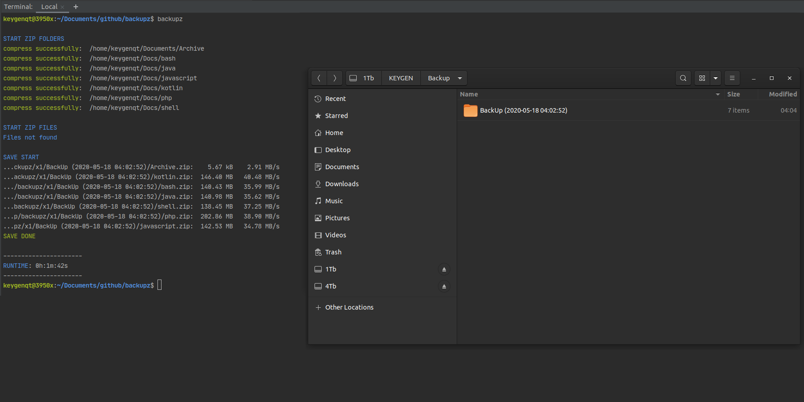

Backupz
===================


### Install for hidden file
```
sudo snap install backupz --devmode
```

### Info

[](https://snapcraft.io/backupz)

Backupz create backup tar.gz archive

* Select dirs
* Select files
* Exclude by regex (tar --exclude)
* Save backup to dir
* Save backup to ftp
* Multiple processes

### Config file:
```
~/snap/backupz/common/config.json
```
or
```
~/.backupz/config.json
```

### Example ftp:
```
{
  "folders": [
    "/home/keygenqt/Documents/Archive",
    "/home/keygenqt/Documents/Android/App"
  ],
  "files": [],
  "exclude": [
    "*.idea*"
  ],
  "save": "ftp:username:pass@192.168.1.70:/Backup",
  "processes": 32
}
```

### Example dir:
```
{
  "folders": [],
  "files": [
     "/home/keygenqt/Documents/archive.txt",
     "/home/keygenqt/Documents/Android/app.apk"
   ],
  "exclude": [
    "*vendor*",
    "*runtime*"
  ],
  "save": "dir:/home/keygenqt/Documents",
  "processes": 32
}
```

### Usage:
```
backupz
```

```
backupz --debug
```



<div>Icons made by <a href="https://icon54.com/" title="Pixel perfect">Pixel perfect</a> from <a href="https://www.flaticon.com/" title="Flaticon">www.flaticon.com</a></div>
